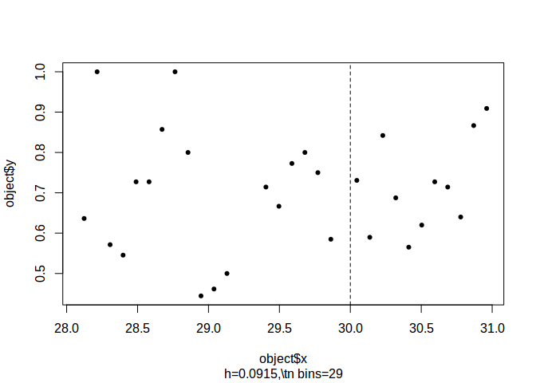
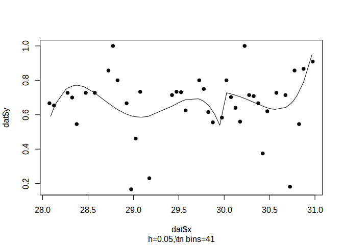
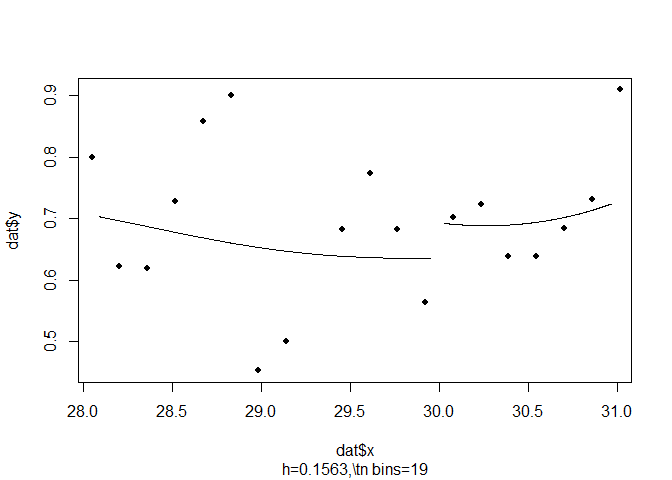
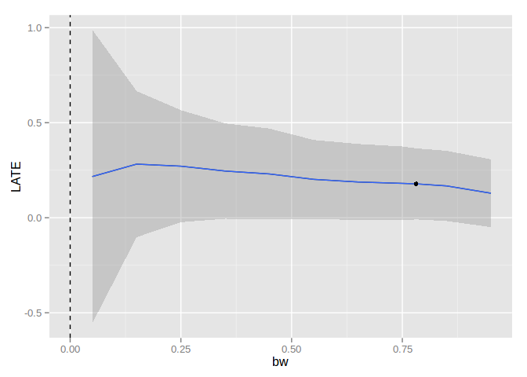

Introduction
============

The `rddtools` package address

Design
======

A unified framework is implemented through the `rdd_data` class which
inherits from the `R` `base` `data.frame` class. This functionality is
made accessible throug hthe associated `rdd_data()` functions and
methods.

The package is designed to leveredge of existing implementations of
**Regression Discontinuity Design** in `R`, such as the `rdd` package.

It implements several variants of RDD previously not implemented. Such
as

-   `dens_test`: McCracy test for manipulation of the forcing variable
-   `rdd_bw_ik`: Imbens-Kalyanaraman Optimal Bandwidth Calculation
-   `rdd_gen_reg`: General polynomial estimator of the regression
    discontinuity
-   `gen_mc_ik`: Monte Carlo simulations of Imbens and Kalyanaraman

Application
===========

we use the data from the Initiative Nationale du Development Humaine
(INDH) a development project in Morocco. The data is included with the
`rddtools` package under the name `indh`.

    data("indh")

Now that we have loading the data we can briefly inspect the structure
of the data.

    summary(indh)

    ##    choice_pg         commune         poverty     
    ##  Min.   :0.0000   Min.   :28.09   Min.   :28.09  
    ##  1st Qu.:0.0000   1st Qu.:29.01   1st Qu.:29.01  
    ##  Median :1.0000   Median :29.95   Median :29.95  
    ##  Mean   :0.6722   Mean   :29.73   Mean   :29.73  
    ##  3rd Qu.:1.0000   3rd Qu.:30.34   3rd Qu.:30.34  
    ##  Max.   :1.0000   Max.   :30.97   Max.   :30.97

The `indh` object is a `data.frame` containing 729 observations
(representing individuals) of three variables:

-   `choice_pg`
-   `commune`
-   `poverty`

The variable of interest is `choice_pg`, which represent the decision to
contibute to a public good or not. The observations are individuals
choosing to contribute or not, these individuals are clustered by the
variable `commune` which is the municiple structure at which funding was
distributed as part of the INDH project. The forcing variable is
`poverty` which represents the number of households in a commune living
below the poverty threshold. As part of the INDH, commune with a
proportion of household below the poverty threshhold greater than 30%
were allowed to distribute the funding using a **Community Driven
Development** scheme. The cutoff point for our analysis is therefore
`30`.

We can now transform the `data.frame` to a special `rdd_data`
`data.frame` using the `rdd_data()` function.

    rdd_dat_indh <- rdd_data(y=choice_pg,
                             x=poverty,
                             data=indh,
                             cutpoint=30 )

The structure is similar but contains some additional information.

    str(rdd_dat_indh)

    ## Classes 'rdd_data' and 'data.frame': 729 obs. of  2 variables:
    ##  $ x: num  30.1 30.1 30.1 30.1 30.1 ...
    ##  $ y: int  0 1 1 1 1 1 0 1 0 0 ...
    ##  - attr(*, "hasCovar")= logi FALSE
    ##  - attr(*, "labels")= list()
    ##  - attr(*, "cutpoint")= num 30
    ##  - attr(*, "type")= chr "Sharp"

In order to best understand our data, we start with an exploratory data
analysis using tables...

    summary(rdd_dat_indh)

    ## ### rdd_data object ###
    ## 
    ## Cutpoint: 30 
    ## Sample size: 
    ##  -Full : 729 
    ##  -Left : 371 
    ##  -Right: 358
    ## Covariates: no

...and plots.

    plot(rdd_dat_indh[1:715,])

We can now continue with a standard Regression Discontinuity Design
(RDD) estimation.

    (reg_para <- rdd_reg_lm(rdd_dat_indh, order=4))

    ## ### RDD regression: parametric ###
    ##  Polynomial order:  4 
    ##  Slopes:  separate 
    ##  Number of obs: 729 (left: 371, right: 358)
    ## 
    ##  Coefficient:
    ##   Estimate Std. Error t value Pr(>|t|)
    ## D  0.26428    0.16590   1.593   0.1116

and visualising this estimation.

    plot(reg_para)

In addition to the parametric estimation, we can also perform a
non-parametric estimation.

    bw_ik <- rdd_bw_ik(rdd_dat_indh)
    (reg_nonpara <- rdd_reg_np(rdd_object=rdd_dat_indh, bw=bw_ik))

    ## ### RDD regression: nonparametric local linear###
    ##  Bandwidth:  0.7812904 
    ##  Number of obs: 467 (left: 146, right: 321)
    ## 
    ##  Coefficient:
    ##   Estimate Std. Error z value Pr(>|z|)  
    ## D 0.178174   0.095319  1.8692  0.06159 .
    ## ---
    ## Signif. codes:  0 '***' 0.001 '**' 0.01 '*' 0.05 '.' 0.1 ' ' 1

and visualising the non-parametric estimation.

    plot(reg_nonpara)

Sensitity tests.

    plotSensi(reg_nonpara, from=0.05, to=1, by=0.1)

References
==========
