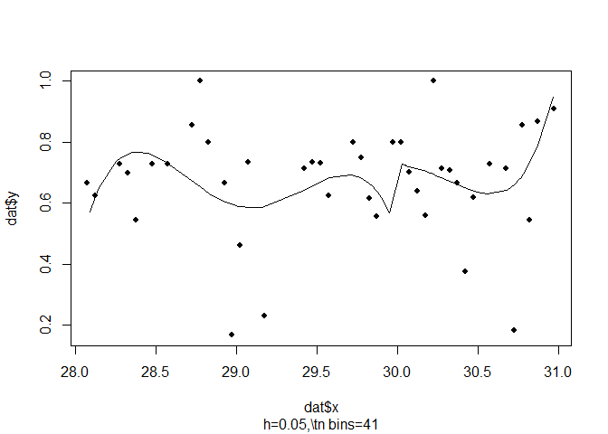
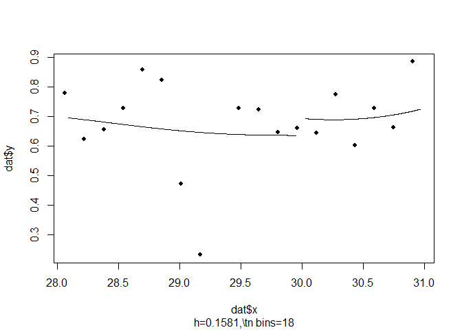

Introduction
============

The `rddtools` package attempts to provide a unified approach to using
Regression Discontinuity Design (RDD) in R.

Design
======

A unified framework for RDD is implemented through the `rdd_data` class
which inherits from the `R` `base` package's `data.frame` class. This
functionality is made accessible through the associated `rdd_data`
function, as well as the following associated methods.

-   `summary.rdd_data()`
-   `plot.rdd_data()`

The package is designed to leveredge of existing implementations of
**Regression Discontinuity Design** in `R`, such as the `rdd` and
`KernSmooth` packages. In addition to this, it implements several tools
for RDD analysis that were previously unavailable.

-   Simple visualisation of the data using binned-plot: `plot()`

Bandwidth Selection
-------------------

Two new mehtods for Bandwidth selection are included. - MSE-RDD
bandwidth procedure of (G. Imbens and Kalyanaraman 2012):
`rdd_bw_ik()` - MSE global bandwidth procedure of (Ruppert, Sheather,
and Wand 1995): `rdd_bw_rsw()`

Estimation
----------

RDD parametric estimation: `rdd_reg_lm()` This includes specifying the
polynomial order, including covariates with various specifications as
advocated in (G. W. Imbens and Lemieux 2008).

RDD local non-parametric estimation: `rdd_reg_np()`. Can also include
covariates, and allows different types of inference (fully
non-parametric, or parametric approximation).

RDD generalised estimation: allows to use custom estimating functions to
get the RDD coefficient. Could allow for example a probit RDD, or
quantile regression.

Post-Estimation
---------------

A collection of Post-Estimation tools allow the robustness of the
estimation results to be verified.

Various tools, to obtain predictions at given covariate values (
`rdd_pred()` ), or to convert to other classes, to lm ( `as.lm()` ), or
to the package `np` ( `as.npreg()` ).

Function to do inference with clustered data: `clusterInf()` either
using a cluster covariance matrix ( `vcovCluster()` ) or by a degrees of
freedom correction (as in (Cameron, Gelbach, and Miller 2008)).

Contains functions to replicate the Monte-Carlo simulations of [Imbens
and Kalyanaraman 2012]: `gen_mc_ik()`

Regression Sensitivity Analysis
-------------------------------

Plot the sensitivity of the coefficient with respect to the bandwith:
`plotSensi()`

**Placebo plot** using different cutpoints: `plotPlacebo()`

Design sensitivity analysis
---------------------------

McCrary test of manipulation of the forcing variable: wrapper
`dens_test()` to the function `DCdensity()` from package `rdd`.

Test of equal means of covariates: `covarTest_mean()`

Test of equal density of covariates: `covarTest_dens()`

Data
====

A collection of typical data sets is included in the package.

-   INDH, Arcand (2015): `indh`
-   Seminal dataset of Lee (2008): `house`

Both data sets is made available as a `data.frame`. Using the previously
discuss `rdd_data()` function we can transform a `data.frame` to an
object of class `rdd_data`, which inherits from `data.frame`.

Here we can the data from the Initiative Nationale du Development
Humaine (INDH), a development project in Morocco. The data is included
with the package under the name `indh`.

    ## [1] "indh"

Now that we have loading the data we can briefly inspect the structure
of the data.

    str(indh)

    ## 'data.frame':    720 obs. of  2 variables:
    ##  $ choice_pg: int  0 1 1 1 1 1 0 1 0 0 ...
    ##  $ poverty  : num  30.1 30.1 30.1 30.1 30.1 ...
    ##  - attr(*, "na.action")=Class 'omit'  Named int [1:11] 58 289 290 291 292 293 294 295 296 297 ...
    ##   .. ..- attr(*, "names")= chr [1:11] "58" "289" "290" "291" ...

The `indh` object is a `data.frame` containing 720 observations
(representing individuals) of two variables:

-   `choice_pg`
-   `poverty`

The variable of interest is `choice_pg`, which represent the decision to
contibute to a public good or not. The observations are individuals
choosing to contribute or not, these individuals are clustered by the
variable `commune` which is the municiple structure at which funding was
distributed as part of the INDH project. The forcing variable is
`poverty` which represents the number of households in a commune living
below the poverty threshold. As part of the INDH, commune with a
proportion of household below the poverty threshhold greater than 30%
were allowed to distribute the funding using a **Community Driven
Development** scheme. The cutoff point for our analysis is therefore
`30`.

We can now transform the `data.frame` to a special `rdd_data`-class
object, inhereting from the `data.frame` class using the `rdd_data()`
function.

    rdd_dat_indh <- rdd_data(y=choice_pg,
                             x=poverty,
                             data=indh,
                             cutpoint=30 )

The `rdd_data()` can be used using the `data` argument, in which case
the function will look for the values o `y` and `x` in this argument
(before looking in the `.GlobalEnv`), if this argument is `NULL`, only
the `.GlobalEnv` will be scanned.

The structure is similar to the original `data.frame` object, but
contains some additional information.

    str(rdd_dat_indh)

    ## Classes 'rdd_data' and 'data.frame': 720 obs. of  2 variables:
    ##  $ x: num  30.1 30.1 30.1 30.1 30.1 ...
    ##  $ y: int  0 1 1 1 1 1 0 1 0 0 ...
    ##  - attr(*, "hasCovar")= logi FALSE
    ##  - attr(*, "labels")= list()
    ##  - attr(*, "cutpoint")= num 30
    ##  - attr(*, "type")= chr "Sharp"

Thee `rdd_data` object has the classes `data.frame` and `rdd_data`. It
contains two variables, `y` the explanandum or dependent variable and
`x` the explanans or driving variable, which is also our discontinuous
variable. Related to the discontinuous variable is the `attribute`
called `cutpoint`, which describes where in the domain of `x` the
discontinuity occurs. Additional exogenous variab

Analysis
========

In order to best understand our data, we start with an exploratory data
analysis using tables...

    summary(rdd_dat_indh)

    ## ### rdd_data object ###
    ## 
    ## Cutpoint: 30 
    ## Sample size: 
    ##  -Full : 720 
    ##  -Left : 362 
    ##  -Right: 358
    ## Covariates: no

...and plots.

    plot(rdd_dat_indh[1:715,])

We can now continue with a standard Regression Discontinuity Design
estimation.

    reg_para <- rdd_reg_lm(rdd_dat_indh, order=4)
    print(reg_para) # uses print.rdd_data

    ## ### RDD regression: parametric ###
    ##  Polynomial order:  4 
    ##  Slopes:  separate 
    ##  Number of obs: 720 (left: 362, right: 358)
    ## 
    ##  Coefficient:
    ##   Estimate Std. Error t value Pr(>|t|)
    ## D  0.22547    0.17696  1.2741    0.203

and visualising this estimation.

    plot(reg_para)

In addition to the parametric estimation, we can also perform a
non-parametric estimation.

    bw_ik <- rdd_bw_ik(rdd_dat_indh)
    (reg_nonpara <- rdd_reg_np(rdd_object=rdd_dat_indh, bw=bw_ik))

    ## ### RDD regression: nonparametric local linear###
    ##  Bandwidth:  0.790526 
    ##  Number of obs: 460 (left: 139, right: 321)
    ## 
    ##  Coefficient:
    ##   Estimate Std. Error z value Pr(>|z|)
    ## D 0.144775   0.095606  1.5143     0.13

and visualising the non-parametric estimation.

    plot(reg_nonpara)

Sensitity tests.

    plotSensi(reg_nonpara, from=0.05, to=1, by=0.1)

Conclusion and Discussion
=========================

The package `rddtools` provides a unified framework for working with
Regression Discontinuity Data in `R`. Functionality already available is
several existing packages, such as `rdd` and `KernSmooth` can now
easilty be utlised using the `rdd_data` framework, as well as several
linking functions.

In addition to this, new tools and algorithms are also implement, as
well as various post-estimation robustness checks.

Future packages implementing further RDD functionality can easily
leverage the `rdd_data` framework, which allows users to quickly access
new functionality through a familiar API.

References
==========

Arcand, Rieger, and Nguyen. 2015. “Development Aid and Social Dyanmics
Data Set.”

Cameron, A Colin, Jonah B Gelbach, and Douglas L Miller. 2008.
“Bootstrap-Based Improvements for Inference with Clustered Errors.” *The
Review of Economics and Statistics* 90 (3). MIT Press: 414–27.

Imbens, Guido W, and Thomas Lemieux. 2008. “Regression Discontinuity
Designs: A Guide to Practice.” *Journal of Econometrics* 142 (2).
Elsevier: 615–35.

Imbens, Guido, and Karthik Kalyanaraman. 2012. “Optimal Bandwidth Choice
for the Regression.”

Lee, David S. 2008. “Randomized Experiments from Non-Random Selection in
US House Elections.” *Journal of Econometrics* 142 (2). Elsevier:
675–97.

Ruppert, David, Simon J Sheather, and Matthew P Wand. 1995. “An
Effective Bandwidth Selector for Local Least Squares Regression.”
*Journal of the American Statistical Association* 90 (432). Taylor &
Francis: 1257–70.
